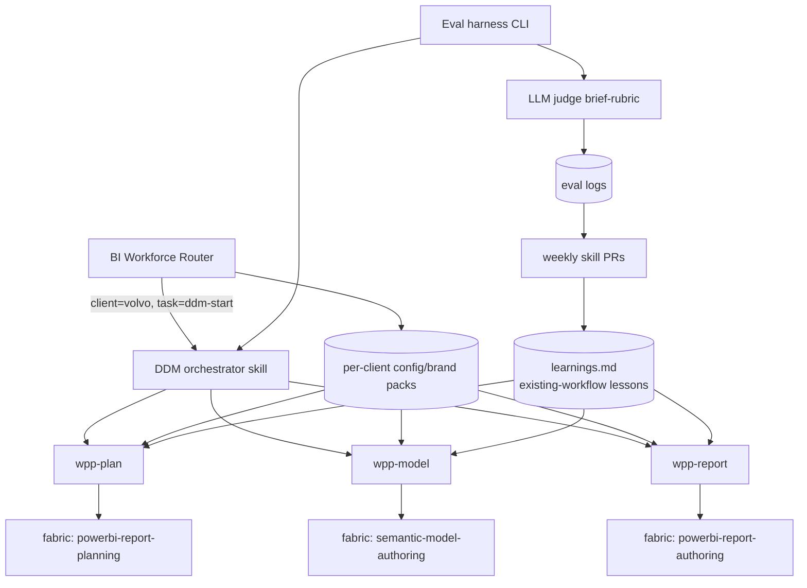

# PRD — Agentic BI Workforce (Power BI automation via Skills)

**Status:** Draft for review · **Owner:** LiMa · **Date:** 2026-06-29 · **POC:** #1 (Volvo DDM)
**Coding agent:** GitHub Copilot (VS Code chat + CLI) · **Pattern:** Skills + Evals + Self-improve (Levels 1–7)
**Brand:** Volvo Centum font · assets in `Reference/` (fonts, golden DDM Summary dashboard, 7 screenshots)

---

## 1. Executive Summary

**Problem.** BI dashboard delivery is slow, manual, and inconsistent. Each client/stream rebuilds calendars, brand frames, and KPI layouts by hand. Knowledge lives in people, not assets.

**Solution.** A reusable agentic workforce: a top **BI-workforce router** dispatches by client/task to a core BI engine of skills (planning → semantic model → report). Volvo DDM is POC #1, designed from day one as a multi-client template.

**Business impact.**
- Cut new-dashboard bootstrap from days to a single supervised run.
- Brand + model consistency enforced by deterministic gates, not reviewers.
- Same engine resells across WPP client streams via config packs.

**Timeline.** PRD → review → scaffold workforce + eval harness → POC overview page → eval-driven iteration.

**Success metrics (POC):** Volvo DDM overview page reproduced end-to-end; 3-tier eval ≥90% pass; brand-frame 0/0 validate; loop produces ≥1 human-approved skill PR.

---

## 2. Problem Definition

- **Who:** WPP BI builders, starting with Volvo Cars DDM team.
- **What:** No repeatable, gradable way to generate brand-correct, model-correct PBIP dashboards.
- **Why now:** Skill-based agents + Power BI MCP + PBIR validation make automation + auto-grading feasible.
- **Cost of not solving:** Manual rebuilds, drift, no learning loop, knowledge loss.

---

## 3. Solution Overview

### 3.1 Architecture
Fabric skills are **foundational/upstream** — never called raw. A WPP engine layer wraps
them with WPP conventions; client packs supply brand. Pin Fabric versions for stable evals.


### 3.2 In scope (POC #1)
- Router + Volvo config pack (tokens, brand, **Volvo Centum font**, logo, theme).
- Ground-truth fixture: `Reference/DDM Summary dashboard` (golden), overview page = `Volvo Media Analtics_1` (KPI & Target Overview).
- DDM end-to-end from raw PBIP; **only the main overview page**.
- 3-tier eval harness (CLI) + Copilot/Opus judge against the approved brief.
- Repo-memory + weekly human-approved skill-PR loop.

### 3.3 Out of scope
- Multi-page reproduction; second client; fully-auto self-rewrite; pricing/GTM.

### 3.4 MVP "working" = overview page reproduced, eval ≥90%, validate 0/0, one approved PR.

---

## 4. Requirements

### 4.1 Stories
```
As a BI builder, I run the workforce on a raw PBIP and get a brand-correct DDM overview page.
As a lead, I run the eval CLI and get model/brand/page pass-rates vs the brief.
As a skill owner, I get weekly PRs proposing skill edits from eval failures.
```

### 4.2 Functional requirements
| ID | Requirement | Priority |
|----|-------------|----------|
| FR1 | Router dispatches by client+task to config pack + DDM skill | P0 |
| FR2 | DDM skill builds model + frame + overview page from brief | P0 |
| FR3 | Brief = ground truth (planning output, prod-applicable; no golden file) | P0 |
| FR4 | Eval: model-integrity, brand-frame, overview-page (+integration) | P0 |
| FR5 | Tier1 deterministic gates (PBIR 0/0, model loads, rel count, tokens, page size) | P0 |
| FR6 | Tier2 LLM judge scores rubric vs brief | P0 |
| FR7 | Eval logs → weekly human-approved skill PR | P1 |
| FR8 | Volvo specifics isolated in config pack; engine client-agnostic | P0 |

### 4.3 Non-functional: CLI repeatable N-runs; deterministic gates before judge; no destructive report.json overwrite.

---

## 5. Eval = spec-as-truth (production-grade)
- Truth is the **approved brief** from planning — same in prod, no golden file needed.
- `setup_1` PBIP is a one-time judge-calibration fixture only.

| Eval | Tier1 gates | Tier2 rubric |
|------|-------------|--------------|
| model-integrity | calendar+rels Ready, 16 rels, no `<=` corruption | model matches brief |
| brand-frame | validate 0/0, page 1300×1400, brand tokens | Volvo brand fidelity |
| overview-page | KPIs/visuals present | KPI+layout vs brief |

---

## 6. Risks
| Risk | P | I | Mitigation |
|------|---|---|-----------|
| Token `<=` DAX corruption | M | H | literal-token replace only (repo memory) |
| Destructive report.json overwrite | M | H | merge, new page |
| Judge subjectivity | M | M | gates first; rubric calibrated on setup_1 |
| Client coupling | M | H | config packs |

---

## 7. Resolved
1. First build = scaffold (router + Volvo pack + eval CLI), in `SKILL-DDM/` then move to separate repo.
2. Eval CLI = PowerShell gates + Python judge (split).
3. Skill PRs land in separate `agentic-bi-workforce` repo; PBIP repo untouched.
